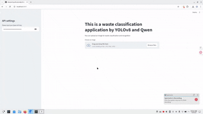

# This is the group assignment for the sixth week of the Industry and Community Engagement course

This project uses Yolov8 to classify different types of garbage and employs a large language model to provide treatment suggestions and carbon footprint calculations for various types of garbage.

## Quick Start

For uv users:

```sh
uv venv
source ./.venv/bin/activate
uv pip install -r requirements.txt
```

For conda users:

```sh
conda create venv python=3.11
conda activate venv
pip install -r requirements.txt
```

After completing the installation of dependencies, run:

```sh
streamlit run app.py
```

Please notice that you need to fill your [Qwen API](https://www.aliyun.com/product/bailian) Key in the web page. 

## Usage



## Acknowledgments

This project utilized a pre-trained model from [teamsmcorg](https://github.com/teamsmcorg/Waste-Classification-using-YOLOv8)

## Group Member

- Changyu Chen

- Baichuan Jiang

- Dongyang Yu

- Yunwei Long

- Xiang Li

- Yian Wang